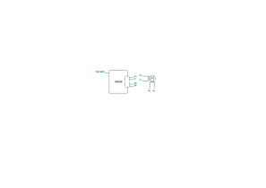
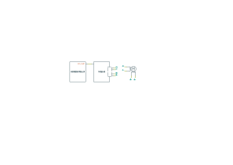
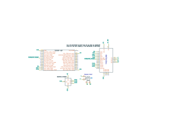
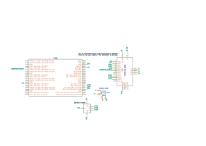
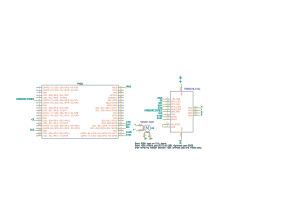

- [Library Information](#org10a7705)
- [Stepper Motors](#org915efb9)
- [Stepper Motor Controllers and Drivers](#org00f4a8d)
- [Modes of Operation](#orgb0c435f)
- [Motor Current](#orgb1921d8)
- [Examples](#org7c04036)
- [Hardware Documentation](#org91fdefd)
- [Host Computer Setup](#orgb2d27e4)

    <!-- This file is generated automatically from metadata -->
    <!-- File edits may be overwritten! -->


<a id="org10a7705"></a>

# Library Information

-   **Name:** TMC51X0
-   **Version:** 2.1.1
-   **License:** BSD
-   **URL:** <https://github.com/janelia-arduino/TMC51X0>
-   **Author:** Peter Polidoro
-   **Email:** peter@polidoro.io


## Description

TMC5130 and TMC5160 are high-performance ICs combining both a stepper motor controller and driver into a single chip.

Both versions have two serial communication interface options for communicating with a microcontroller, either SPI or UART, and both combine a flexible ramp generator for automatic target positioning with an advanced stepper motor driver.

The TMC5130 and TMC5160 are register compatible, with a few exceptions, allowing the same driver library to work with both.

Both versions have encoder inputs and reference switch inputs for optional position feedback and both have 256 microsteps per full step high resolution positioning.

The TMC5130 includes MOSFETs inside the IC to reduce part count and circuit size for driving motors up to 1.64A RMS per coil at a voltage supply range from 4.75 to 46V.

The TMC5160 uses external MOSFETs to drive higher current motors from 1A to several 10A per coil and may be driven at higher voltages than the MOFSFETs included in the TMC5130.




<a id="org915efb9"></a>

# Stepper Motors

From Wikipedia, the free encyclopedia:

A stepper motor, also known as step motor or stepping motor, is a brushless DC electric motor that divides a full rotation into a number of equal steps. The motor's position can be commanded to move and hold at one of these steps without any position sensor for feedback (an open-loop controller), as long as the motor is correctly sized to the application in respect to torque and speed.

[Wikipedia - Stepper Motor](https://en.wikipedia.org/wiki/Stepper_motor)


<a id="org00f4a8d"></a>

# Stepper Motor Controllers and Drivers

Stepper motors need both a controller and a driver.


## Stepper Motor Controller

A stepper motor controller is responsible for the commanding either the motor kinetics, the torque, or the motor kinematics, the position, speed, and acceleration of one or more stepper motors.


## Stepper Motor Driver

A stepper motor driver is responsible for commanding the electrical current through the motor coils as it changes with time to meet the requirements of the stepper motor controller.


## Separate Controller and Driver

In some systems, the controller (e.g. TMC429) and driver (e.g. TMC2209) may be separate components which communicate over an interface, such as step and direction signals from the controller to the driver or perhaps serial lines.

This type of setup makes it easy to coordinate multiple axes of motion by connecting several drivers to a single multi-axis controller. It also makes it easy to swap one driver for another if necessary as long as they both use the same communication interface.


## Combined Controller and Driver

The TMC5130 and TMC5160 chips combine the controller and driver into a single component, which both reduces the circuit board part count and allows more sophisticated coordination between the controller and driver than the motion commands from simple step and direction signals.

For example, combining the controller and driver allows the chip to modify the drive current and current regulation mode automatically at different motor velocities or reduce the motor velocity automatically if the driver senses that the motor may be about to miss steps or stall.


<a id="orgb0c435f"></a>

# Modes of Operation

The TMC5130 and TMC5160 chips have many settings and several modes of operation. These modes may be switched externally or they may be switched automatically depending on motor velocity or other measured parameters.


## StealthChop (DriverParameters.stealth\_chop\_enabled = true)

StealChop is an extremely quiet mode of operation based on voltage control. It is ideal for standstill and low velocities. The motor current is applied by setting the voltage on each coil using pulse width modulation (PWM).

The pulse width of the voltage supplied to each motor coil sets the current through each motor coil and the magnitude depends on the motor resistance, the back EMF of the motor, and the voltage supply level.

The resistance of the motor coil windings tends to be constant, but the back EMF of the motor increases with motor velocity requiring the pulse width to increase as the motor velocity increases. The voltage supply level may or may not remain constant. Some power supplies may have reduced voltage at increased current output or if a battery is used, the voltage may drop over time as the battery drains.

Two algoritm options are provided for setting the current based on the voltage, either a manual mode or an automatic mode.


### Manual Current Regulation (DriverParameters.automatic\_current\_control\_enabled = false)

In manual mode, the motor current is not measured directly rather it is set in an open-loop fashion using feed-forward velocity control. Manual mode is not able to react to supply voltage changes or events like a motor stall, but it provides a very stable amplitude.

This mode is ideal when the motor type and the supply voltage are well known.


### Automatic Current Regulation (DriverParameters.automatic\_current\_control\_enabled = true)

In automatic mode, the motor current is measured through the current sense resistors and is set in a closed-loop fashion allowing it to automatically adjust to environmental changes. Automatic mode requires a calibration routine in order to function properly.


### DriverParameters.pwm\_offset

In order to calculate the voltage pulse width magnitude given the desired motor current, the pwm\_offset is used to scale the magnitude based on the constant dependencies, such as the motor resistance and the power supply voltage.


### DriverParameters.pwm\_gradient

In order to calculate the voltage pulse width magnitude given the desired motor current, the pwm\_gradient is used to scale the magnitude based on the dependencies that change with the motor velocity, such as the motor back-EMF.


## SpreadCycle (DriverParameters.chopper\_mode = SpreadCycleMode)

While StealthChop uses voltage control, SpreadCycle uses current control, allowing it to quickly react to changes in motor velocity or motor load.


<a id="orgb1921d8"></a>

# Motor Current

Several settings affect the magnitude of the motor current, depending on what mode the driver is in at a given velocity.


## DriverParameters.global\_current\_scaler

Global scaling of Motor current. This value is multiplied to the current scaling to adapt a drive to a certain motor type. This value should be chosen before tuning other settings because it also influences chopper hysteresis.


### Real Units

Range 0..100 percent > 50 percent recommended for best results


### Chip Units

Range 0..255 0: full scale 1..31 not allowed for operation 32..255 32/256..255/256 of maximum current


## DriverParameters.run\_current


### Automatic Current Control Enabled

run\_current scales the current magnitude based on readings from the sense resistors.


### Automatic Current Control Disabled

The current magnitude is not enforced by regulation using the sense resistors, but run\_current still scales the PWM amplitude.


## DriverParameters.pwm\_offset and DriverParameters.pwm\_gradient


### Automatic Current Control Enabled

pwm\_offset and pwm\_gradient are used as initial values for automatic scaling.


### Automatic Current Control Disabled

pwm\_offset and pwm\_gradient scale the PWM amplitude.


<a id="org7c04036"></a>

# Examples


## Wiring


### Microcontroller




### SPI

1.  TMC51X0-BOB

    1.  Teensy 4.0
    
        
    
    2.  Pico
    
        

2.  TMC51X0-EVAL

    1.  Pico
    
        

3.  Wiring Documentation Source

    <https://github.com/janelia-kicad/trinamic-wiring>


<a id="org91fdefd"></a>

# Hardware Documentation


## Datasheets

[Datasheets](./datasheet)


<a id="orgb2d27e4"></a>

# Host Computer Setup


## Download this repository

<https://github.com/janelia-arduino/TMC51X0.git>

```sh
git clone https://github.com/janelia-arduino/TMC51X0
```


## PlatformIO


### Install PlatformIO Core

<https://docs.platformio.org/en/latest/core/installation/index.html>

```sh
python3 -m venv .venv
source .venv/bin/activate
pip install pip --upgrade
pip install platformio
pio --version
```


### 99-platformio-udev.rules

Linux users have to install udev rules for PlatformIO supported boards/devices.

1.  Download udev rules file to /etc/udev/rules.d

    ```sh
    curl -fsSL https://raw.githubusercontent.com/platformio/platformio-core/develop/platformio/assets/system/99-platformio-udev.rules | sudo tee /etc/udev/rules.d/99-platformio-udev.rules
    ```

2.  Restart udev management tool

    ```sh
    sudo service udev restart
    ```

3.  Add user to groups

    ```sh
    sudo usermod -a -G dialout $USER && sudo usermod -a -G plugdev $USER
    ```

4.  Remove modemmanager

    ```sh
    sudo apt-get purge --auto-remove modemmanager
    ```

5.  After setting up rules and groups

    You will need to log out and log back in again (or reboot) for the user group changes to take effect.
    
    After this file is installed, physically unplug and reconnect your board.


### Compile the firmware

1.  Gnu/Linux

    ```sh
    make firmware
    ```

2.  Other

    ```sh
    pio run -e teensy40
    ```


### Upload the firmware

1.  Gnu/Linux

    ```sh
    make upload
    ```

2.  Other

    ```sh
    pio run -e teensy40 -t upload
    ```


### Serial Terminal Monitor

1.  Gnu/Linux

    ```sh
    make monitor
    ```

2.  Other

    ```sh
    pio device monitor --echo --eol=LF
    ```


## Arduino Ide


### Download

<https://www.arduino.cc/en/software>


### Additional Boards Manager URLs

File > Preferences

    https://www.pjrc.com/teensy/package_teensy_index.json
    https://github.com/earlephilhower/arduino-pico/releases/download/global/package_rp2040_index.json


### Add Board Support Packages

-   Teensy by Paul Stroffregen
-   Raspberry Pi Pico/RP2040 by Earle F Philhower, III
